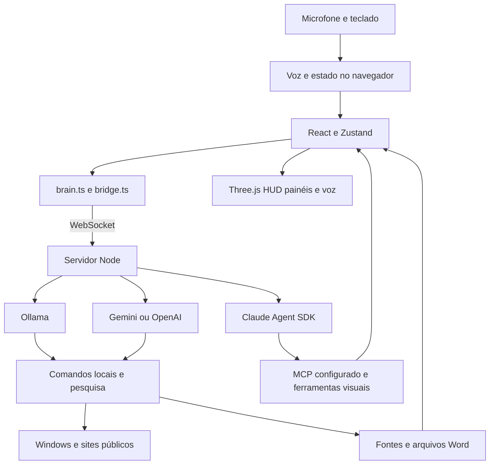

# Estado real do Projeto JARVIS

Auditoria de 23 de setembro de 2026, preparada para Matheus Ribeiro.

## Atualização — Etapa 1A implementada

A implementação incremental de execução e diagnóstico foi autorizada e concluída após a auditoria abaixo. Veja [entrega da Etapa 1A](ETAPA_1A.md) para estados, cancelamento, arquivos, testes e limitações. A03/A07/A09 receberam correções e A08 recebeu propagação do sinal de rede. Resultado: 28 testes passaram; build passou; lint sem erros, com dois avisos anteriores. A validação manual de voz e aplicativos continua pendente. A auditoria abaixo preserva o snapshot histórico anterior às correções.

## Conclusão executiva

O projeto principal já é um assistente web funcional com interface 3D, voz em português brasileiro, integração local com Ollama, comandos Windows, pesquisas públicas e geração de relatórios Word. A base deve ser preservada. Não há motivo demonstrado para reescrever a interface, trocar o bridge Node ou migrar todo o projeto para Python.

O sistema ainda não é uma plataforma com memória híbrida, projetos, perfis isolados, permissões unificadas ou integrações completas com os serviços planejados. Esses recursos devem ser construídos incrementalmente sobre os módulos existentes. O próximo passo recomendado é **estabilizar a execução atual, medir a qualidade das pesquisas e definir um contrato comum de ferramentas**, antes de conectar mais serviços ou guardar dados sensíveis.

## Escopo e método

- Base principal confirmada pelo usuário: `jarvis-chatgpt` neste workspace.
- Snapshot do repositório principal: branch `main`, commit `7738d33`.
- Análise de arquivos versionados, histórico local Git, configurações sem divulgar segredos, dependências instaladas, módulos e testes.
- A pasta irmã `.jarvis-cloud-stage` foi analisada como preparação separada. A outra instalação Python fora do workspace não foi incorporada nem auditada integralmente, conforme a escolha do usuário.
- Nesta etapa, alterações de produto foram suspensas. Somente documentação foi editada; build e testes produziram seus artefatos normais, ignorados pelo Git.
- Não foram executados `apply_changes.py`, instalação de programas, `npm audit fix`, migrações Supabase, alterações de credenciais, commits ou publicação.
- As implementações de pesquisa e relatórios solicitadas anteriormente já constavam do snapshot auditado. Código presente, teste passando e funcionalidade ativada em um processo antigo são estados diferentes; esta auditoria não reiniciou a instalação do usuário.

Classificação utilizada: **implementado** significa que o código existe; **validado** indica o teste descrito; **parcial** significa que existe apenas parte do requisito; **não localizado** significa ausência no escopo inspecionado, não uma afirmação sobre outros computadores ou repositórios.

## Repositórios e origem

Há dois níveis Git: a raiz do workspace tem um repositório sem commits e considera as duas pastas como não rastreadas. O repositório efetivo do aplicativo está dentro de `jarvis-chatgpt`. As operações Git de desenvolvimento devem ser feitas nessa pasta, sem tentar reorganizar os dois níveis nesta auditoria.

| Evidência local | Resultado |
| --- | --- |
| `origin` | `https://github.com/wenklostsy/jarvis.git` |
| `upstream` | `https://github.com/adewaskar/jarvis.git` |
| Referência local `upstream/main` | `1c4016a`, de 05/08/2026 |
| Adaptação posterior | `e2f3acf`, de 22/09/2026, português e comandos locais |
| Snapshot atual | `7738d33`, de 23/09/2026, pesquisas e relatórios |
| Diferença acumulada em relação à referência upstream local | 31 arquivos, 1.693 inserções e 98 exclusões |
| Licença e créditos musicais | Preservados em relação à referência upstream local |

As referências remotas acima foram lidas do clone; não foi feito `fetch`, `pull` ou `push`. Elas não constituem uma verificação do estado atual do servidor GitHub. Consulte [Origem e licenças](ORIGEM_E_LICENCAS.md).

## Arquitetura existente

O desenho representa os caminhos lógicos. Nos backends alternativos, comandos reconhecidos são executados antes da chamada ao modelo; o modelo não possui um registro geral de ferramentas Windows. Existe também um modo `direct` que chama Anthropic no navegador, separado do bridge.

| Área | Arquivos principais | Responsabilidade atual |
| --- | --- | --- |
| Inicialização | `scripts/start.mjs`, `scripts/setup.mjs`, `vite.config.ts` | Iniciar bridge/Vite, verificar requisitos; tentar iniciar o Ollama já instalado |
| Coordenação de interface | `src/App.tsx`, `src/store.ts` | Estados de escuta, fala, ferramentas, transcrição, painéis e reconexão |
| Visualização | `src/scene/*`, `src/ui/*`, `src/index.css` | Reator, partículas, órbitas, HUD, cartões, resultados e diagnósticos |
| Transporte | `src/lib/brain.ts`, `src/lib/bridge.ts` | Escolher backend, WebSocket, identificação de pedidos, interrupção e reconexão |
| Voz | `voice.ts`, `vad.ts`, `tts.ts`, `audio.ts` | Reconhecimento, montagem de frases, detecção de eco, fila de fala e cancelamento |
| Câmera e gestos | `camera.ts`, `hands.ts`, `oneEuro.ts`, `clap.ts` | Captura, buffer temporal, detecção/suavização de mãos e interação |
| Servidor | `bridge/server.mjs` | HTTP, WebSocket, speech proxy, mídia, arquivos, relatórios e caminho Claude/MCP |
| Modelos alternativos | `bridge/ollama.mjs`, `gemini.mjs`, `openai.mjs` | Conversa, histórico da conexão e despacho inicial para comandos locais |
| Comandos Windows | `bridge/local-commands.mjs` | Parser português, programas e sites permitidos, pastas, configurações, timers |
| Pesquisa | `bridge/research.mjs`, `research-model.mjs` | Busca, leitura pública, síntese, proveniência e apresentação de resultados |
| Documento | `bridge/reports.mjs` | DOCX editável e persistência dos relatórios em `reports/` |
| Rede pública | `bridge/net.mjs`, `page.mjs` | Limites de tamanho/tempo, validação de destinos, redirecionamentos e leitura/proxy |
| Ferramentas Claude | `chrome.mjs`, `panels.mjs`, `ui.mjs`, `vision.mjs` | Navegador, apresentação, personalização visual e câmera por MCP |

O arquivo `server.mjs` concentra várias responsabilidades. Uma eventual extração deve ser orientada por testes e manter o protocolo atual; não é requisito para aproveitar a base.

## Funcionalidades verificadas no código

### Inteligência e execução

O `.env` local seleciona `JARVIS_BRAIN=ollama` e `JARVIS_LOCAL_MODEL=qwen3.5:4b`. Valores de credenciais não foram copiados para este relatório. Gemini, OpenAI e Claude permanecem opcionais. A existência do adaptador ou de uma chave não comprova disponibilidade, cota ou funcionamento do serviço.

Ollama usa a API local de chat, histórico em memória e `stream: false`. Gemini e OpenAI têm adaptadores semelhantes. Os três chamam comandos locais e a pesquisa; somente o caminho Claude usa diretamente o conjunto MCP original. Há duplicação de ciclo de vida, histórico, cancelamento e preparação de prompts entre adaptadores.

No modo atual, a interpretação de comandos é predominantemente feita por expressões regulares. Há normalização de acentos, vocativos, pedidos educados, variações de WhatsApp/YouTube e uma pergunta de esclarecimento quando falta o assunto. Isso ajuda, mas ainda não equivale a um planejador geral capaz de combinar ferramentas registradas.

### Voz

- Reconhecimento pelo navegador configurado para `pt-BR`; há caminho alternativo ElevenLabs Scribe quando disponível.
- Preferência por vozes portuguesas do sistema, com seleção persistida em `localStorage` na chave `jarvis.voice`.
- Detecção de eco, interrupção da fala e montagem de segmentos reconhecidos.
- Diagnósticos visuais e mecanismos de recuperação de reconhecimento.
- O processamento local pelo Ollama não torna automaticamente o reconhecimento do navegador offline. A implantação precisa explicar qual serviço de voz está ativo.
- O ambiente Python da voz `pm_alex` foi removido anteriormente. Isso não removeu o componente original opcional `kokoro-js`, que continua no projeto, com vozes britânicas e modelo ONNX próprio.
- Existem dependências e uma configuração para Porcupine, mas não foi localizado um caminho operacional de Porcupine em `voice.ts`; não deve ser anunciado como disponível sem integração/teste.

### Controle do Windows e automações

Existem ações para abrir programas conhecidos, sites, pastas especiais e páginas de configurações do Windows. O launcher utiliza `spawn` com argumentos separados, sem transformar o texto falado em comando livre de shell. VS Code é procurado em caminhos conhecidos.

Timers/lembretes são mantidos em memória por conexão, têm limite de quantidade e duração, podem ser listados e cancelados. Não são automações persistentes: desconectar, atualizar ou encerrar o servidor elimina esses agendamentos. Não há agendador durável, gatilhos recorrentes ou recuperação após reinício.

O programa confirma a criação do processo, não a presença da janela/aplicação ou o carregamento efetivo do site. “Abrindo WhatsApp” não é prova de que o Windows abriu o navegador corretamente. Deve existir uma distinção futura entre solicitação aceita e efeito confirmado.

### Pesquisas e relatórios

O código já pesquisa tentando Google, depois DuckDuckGo e Bing, com identificação do provedor. Lê páginas públicas, consulta trechos, produz síntese pelo modelo configurado e exibe links. Há buscas por domínio, YouTube, leitura de URL, nova pesquisa com relatório e relatório baseado na última consulta.

O gerador cria Word com título, destinatário, síntese, método, fontes e indicação de revisão. Os arquivos usam UUID e ficam em disco; o servidor oferece download por um nome restrito, sem aceitar caminhos arbitrários.

Limites relevantes:

- Login, CAPTCHA, JavaScript, tamanho de resposta e formatos não suportados podem impedir leitura.
- A extração é simplificada e limitada por caracteres; não é uma compreensão integral da página.
- Pesquisar páginas do YouTube não significa assistir ao vídeo nem obter sua transcrição.
- Testes anteriores nesta sessão obtiveram links reais, mas também resultados pouco relacionados ao tema de vídeos solicitado. A relevância precisa ser testada explicitamente.
- Síntese com citações não garante que toda afirmação esteja sustentada. Ainda faltam verificação de citações, preferência por fontes primárias e avaliação de atualidade.
- A disponibilidade de uma busca sem chave depende das páginas públicas dos buscadores, não de um contrato estável de API.
- Há fallback identificado para trechos coletados quando a síntese falha.

### Dashboard e personalização

O dashboard já apresenta conversa, fase do assistente, ferramentas, fontes e relatórios. Tem componentes que podem ser reutilizados em projetos e configurações, mas ainda não possui telas completas para gerenciar esses domínios.

Existem nome e personalidade em prompts, modelo e serviços por variáveis de ambiente, seleção de voz e ferramentas visuais do caminho Claude. Nome/usuário continuam fixos em diversos lugares. Não existe perfil persistente e isolado por instalação, cadastro de dispositivos ou cofre de credenciais da aplicação.

## Comparação com o planejamento

| Módulo desejado | Estado real | Reaproveitamento e lacuna |
| --- | --- | --- |
| Core com Ollama | Implementado | Preservar adaptador e protocolo; adicionar contrato comum de execução |
| Ferramentas registráveis | Parcial | Há MCP no Claude e parser de comandos nos demais; não há catálogo único |
| Controle do Windows | Parcial funcional | Preservar lançadores permitidos; ampliar com resultado verificável e permissões por ação |
| Voz e linguagem natural | Implementado com limites | Reaproveitar detecção/eco/filas; testar transcrições reais e clarificações |
| Permissões | Parcial e desigual | Política Claude por nomes de ferramentas e flag global; comandos locais seguem outra política |
| Automações | Timers temporários | Falta armazenamento, recorrência, retomada e cancelamento durável |
| Projects | Não localizado como domínio | Abrir GitHub/VS Code existe; CRUD de projetos, tarefas e integração Git não |
| Laravel, Python e Onshape | Não localizado no web | Não confundir capacidade de abrir editor com gerenciamento desses projetos |
| Memory | Histórico de sessão e voz local | Relatórios persistem como arquivos; não há memória de conversas, embeddings ou sincronização |
| Supabase | Separado da aplicação web | Worker Python aproveitável conceitualmente; não integrado a este runtime |
| Google Calendar, Gmail e Drive | Abertura de sites e possibilidade MCP | Sem conectores próprios OAuth/API no modo Ollama |
| GitHub | Site e configuração MCP no modo direto | Sem gestão nativa de repositórios/projetos no modo atual |
| Home Assistant | Entrada MCP opcional no modo direto | Não comprova serviço instalado ou integração ativa com Ollama |
| Open-Meteo, BrasilAPI, ViaCEP, IBGE, Frankfurter | Não localizados | Bons candidatos para conectores pequenos após contrato de ferramentas |
| TMDB, NASA e OpenStreetMap | Não localizados | Google Maps atual é um link de pesquisa, não integração OpenStreetMap |
| Alexa | Preparação externa parcial | Filtro `source=alexa` no worker não equivale a skill Alexa ou endpoint de entrada |
| Personalization por instalação | Parcial | Preservar aparência/voz; remover dependência de identidade fixa por configuração, sem perder perfil de Matheus |
| Dashboard de projetos/configurações | Não implementado como domínio | Estender React/Zustand e os painéis existentes |
| Legacy privado | Não localizado | Não há cofre, herdeiros, criptografia de acervo, custódia, liberação ou backups redundantes |

“Não localizado” considera os arquivos examinados. Não significa que os respectivos serviços não existam em outras contas ou instalações.

## Testes e verificações

Ambiente: Windows, Node `24.18.0`, npm `11.16.0`; Python de validação `3.12.14` fornecido pelo ambiente de trabalho. Nenhum ambiente Python do produto foi instalado ou reparado nesta auditoria.

| Verificação | Resultado e alcance |
| --- | --- |
| `node --test bridge/local-commands.test.mjs bridge/research.test.mjs` | 15 passaram, zero falhas; parser, comandos simulados, timers, busca simulada, limites de destinos, relatórios e falhas |
| `npm run build` | Passou: TypeScript e Vite; 615 módulos transformados |
| `npm run lint` | Zero erros; dois avisos existentes sobre `err` e `probeUrl` não utilizados |
| `git diff --check` | Sem erros na base auditada |
| Auditoria npm somente leitura | 8 entradas vulneráveis: 5 altas, 3 moderadas, zero críticas |
| Preparação Python, suíte local de 27 casos | 21 passaram, uma falha de configuração e cinco erros por dependências/módulos ausentes; rede bloqueada |

O build avisa sobre módulos `node:fs`/`node:path` externalizados a partir do SDK Anthropic e bundles grandes. Os maiores artefatos incluem cerca de 1,72 MB de JS principal, 2,19 MB de chunk Kokoro e 21,6 MB de WASM ONNX, antes de compressão. São oportunidades de carregamento opcional e revisão de dependências, não motivo para remover funcionalidades nesta etapa.

Os testes Node usam ações simuladas e não abriram programas, enviaram mensagens ou acessaram contas externas. A suíte não cobre microfone real, todos os estados da interface, todos os provedores, reconexão/concorrência nem qualidade factual/relevância de pesquisa. Não existe script `npm test` nem pipeline de CI localizado nos arquivos versionados.

Antes desta auditoria, na mesma sessão, houve teste exploratório de pesquisa pública, geração de DOCX e download HTTP em instância temporária: retorno 200 para o relatório e 404 para caminho inválido. Isso é evidência pontual, não teste de ponta a ponta de todas as funcionalidades. A apresentação do Word também foi inspecionada em uma iteração anterior; o gerador continua precisando de teste visual repetível.

### Dependências sinalizadas pelo npm

| Pacote | Severidade informada | Relação |
| --- | --- | --- |
| `kokoro-js` | Alta | Direta; cadeia `@huggingface/transformers` → `sharp` |
| `@huggingface/transformers` | Alta | Transitiva |
| `sharp` | Alta | Transitiva; bibliotecas nativas de imagens |
| `fast-uri` | Alta | Transitiva |
| `nanoid` | Alta | Transitiva |
| `dompurify` | Moderada | Direta; sanitização de conteúdo |
| `hono` | Moderada | Transitiva |
| `qs` | Moderada | Transitiva |

Essas oito entradas não significam oito vulnerabilidades exploráveis na configuração atual. É necessário verificar os caminhos usados. Por exemplo, o aviso de DOMPurify envolve um modo de hook específico; a presença do pacote não demonstra que esse modo esteja ativo. Não foram aplicadas correções automáticas. O npm não indicou correção automática para toda a cadeia Kokoro/Transformers/sharp no snapshot consultado.

## Problemas e melhorias prioritárias

| ID | Prioridade | Evidência e consequência | Proposta a aprovar |
| --- | --- | --- | --- |
| A01 | Alta antes de compartilhamento | `server.listen(PORT)` não fixa loopback; `Origin` não é autenticação e pode ser definido por clientes nativos. Endpoints HTTP aceitam pedidos sem Origin. A exposição efetiva depende também da rede/firewall. | Restringir bind local por padrão e projetar autenticação explícita para dispositivos/remoto |
| A02 | Alta | `decideTool`/`JARVIS_ALLOW_WRITES` governam Claude/MCP, não constituem uma política uniforme dos comandos locais e relatórios. | Definir escopos de ação e resultado comum, mantendo permissões atuais compatíveis |
| A03 | Alta | Adaptadores usam `queue.then(...)`; interrupção aborta trabalho ativo, mas não invalida explicitamente toda a fila. Fechamento não garante que comandos já enfileirados nunca iniciem. | IDs de execução, descarte de pedidos cancelados e testes de concorrência/fechamento |
| A04 | Alta | Auditoria de dependências tem oito entradas; parte vem do Kokoro opcional ainda instalado. | Avaliar uso real e atualizações controladas, com regressão; nenhuma remoção automática |
| A05 | Média alta | Pesquisa depende de HTML/RSS e a consulta de YouTube apresentou resultados pouco relevantes em teste exploratório. | Métricas de relevância, filtro de anúncios, validade de links e fallback que informe falta de resultado pertinente |
| A06 | Média alta | Sumário usa texto parcial e não valida cada citação/afirmação. | Verificar índices de fontes, datas, conteúdo suficiente e separar evidência de inferência |
| A07 | Média | Pesquisa e ferramentas emitem alguns eventos sem `ask`; frontend aceita eventos sem identificação. Prazos de síntese e inatividade são ambos de 120 segundos. | Propagar ID, apresentar progresso e coordenar timeouts; testar respostas atrasadas |
| A08 | Média | `readSource` não recebe um AbortSignal até a requisição de baixo nível. | Cancelamento fim a fim e prazos totais, além de timeout de inatividade |
| A09 | Média | Sucesso em `spawn` é interpretado como abertura; não há confirmação do efeito. | Resultado com estados aceito, concluído, falhou e efeito não confirmado |
| A10 | Média | `.env.example`, README original e setup descrevem sobretudo Claude; `bridge:writes` usa sintaxe de variável típica de shell POSIX. | Setup específico por backend/SO e documentação de Node compatível com dependências |
| A11 | Média | `engines.node >=20` é menos restritivo que Vite/oxlint/plugin React (`^20.19.0 || >=22.12.0`). | Alinhar manifesto e verificações, testando a versão mínima de fato |
| A12 | Média | Matheus está fixo em prompts/relatórios; dados não têm owner/device e não há isolamento de perfis. | Configuração individual e armazenamento por instalação antes de distribuir |
| A13 | Média | Histórico e pesquisa anterior somem com a conexão; Gemini/OpenAI não registram resultados locais no histórico da mesma forma que Ollama. | Consistência de contexto e futura memória persistente com retenção explícita |
| A14 | Média | Módulo Chrome usa caminho de socket Unix `/tmp/...` e é desativado para os backends alternativos. | Não anunciar controle integral de Chrome no Windows/Ollama; avaliar adaptador Windows posteriormente |
| A15 | Média | Modo `direct` coloca chaves/tokens `VITE_*` no navegador; código já reconhece o limite de demo local. | Manter segredos no servidor no produto compartilhável; não publicar bundle com credenciais |
| A16 | Média | Frontend e modelos opcionais carregam componentes pesados; partes do dashboard/erros ainda estão em inglês. | Medir latência e memória; carregamento opcional, localização e acessibilidade sem refazer a UI |

A01–A16 são achados de análise e observações dos testes, não correções implementadas nesta auditoria. Os cenários de concorrência, rede e abuso devem ser reproduzidos em testes isolados antes da alteração.

## O que preservar e reaproveitar

Preservar a interface React/Three.js, store, protocolo WebSocket, fila de voz, detecção de eco, controles de câmera/gestos, módulos de rede com validação de DNS/redirecionamentos e os adaptadores de modelo. São bases úteis, com responsabilidades já identificáveis.

Reaproveitar o parser como caminho rápido para comandos frequentes. Um catálogo futuro pode chamar as mesmas funções, evitando criar um segundo conjunto de ações. Preservar o pipeline de pesquisa e DOCX, acrescentando qualidade, progresso e testes em vez de um gerador paralelo.

No material Python, aproveitar o desenho de reserva condicional da fila, o resultado explícito de sucesso e a separação entre executar ação e repetir a gravação de seu resultado. Não copiar o worker para Node sem decidir autenticação, identidade de instalação e formato de comando.

## Próxima etapa recomendada

Solicitar aprovação para a **Etapa 1 do roadmap: estabilização e contrato de execução**. Entregar uma versão previsível daquilo que já existe: abertura de sites, pesquisa com conteúdo pertinente, cancelamento sem ações atrasadas, relatório baixável e diagnóstico claro do backend ativo. Descrever um contrato de ferramentas e permissões antes de efetuar a extração estrutural.

Memória, Projects, novas integrações e Legacy ficam em etapas posteriores. O Legacy precisa de isolamento e modelo de confiança próprios, não deve ser ativado como uma pasta pública de relatórios nem depender de uma decisão autônoma do modelo.

O detalhamento e os critérios de aceite estão no [roadmap](ROADMAP.md). Nenhuma etapa estrutural está aprovada por este documento.
